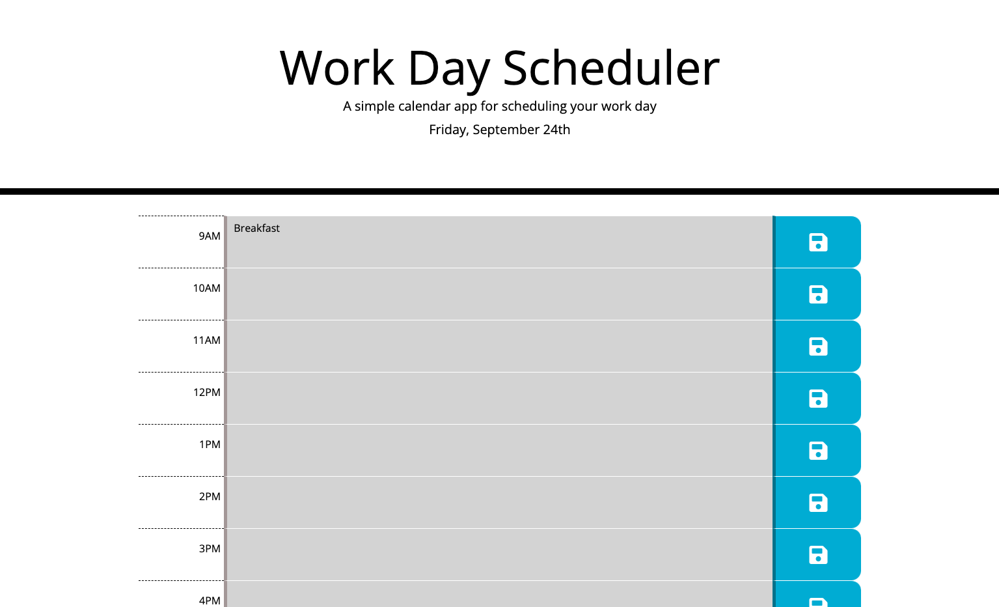

# day-planner

* day-panner is an interactive site that will allow the user to input their tasks and plans for the day. Times run from 9AM-5PM in one-hour blocks.

* To use the planner, click into the hour and make your plans, then save with the button on the right of the hour block.

*Gray times are in the past, red is the current hour, and green is in the future.

* See page at https://caitlinw29.github.io/day-planner/
